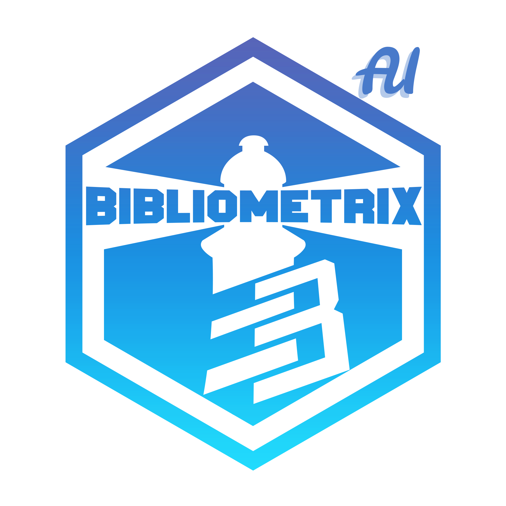
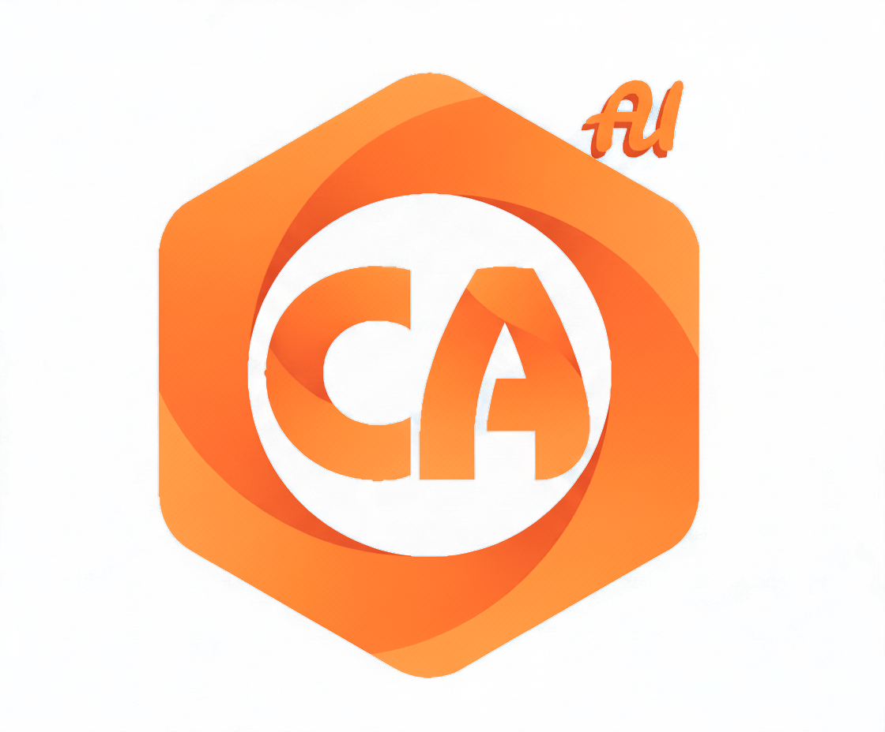
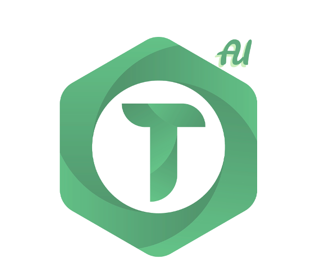

::: {.hero}
::: {.hero-container}

# Summer School <br> in Science Mapping {.hero-title}

::: {.hero-subtitle}
AI-Enhanced Knowledge Synthesis: SLR, Content Analysis e Text Analysis in un unico ecosistema
:::

::: {.hero-edition}
IV Edizione Italiana
:::

::: {.hero-edition-row}
::: {.hero-info}
::: {.hero-info-item}
::: {.hero-info-label}
Date
:::
::: {.hero-info-value}
25-29 Maggio 2026
:::
:::

::: {.hero-info-item}
::: {.hero-info-label}
Sede
:::
::: {.hero-info-value}
Università degli Studi di Napoli Federico II <br>
<span class="hero-info-value-sub">Complesso Universitario di Monte Sant’Angelo</span>
:::
:::
:::
:::

::: {.hero-cta}
[Iscriviti Ora](registrazione.html){.hero-button}
:::

:::
:::

## La Scuola

La **IV Edizione Italiana** della Summer School in Science Mapping (SSSM 2026) è organizzata dallo spin-off accademico **K-Synth** e dal **Dipartimento d'Eccellenza di Scienze Economiche e Statistiche** dell'Università degli Studi di Napoli Federico II.

La direzione scientifica è affidata ai Professori **Massimo Aria** e **Corrado Cuccurullo**, fondatori del team K-Synth e autori dell'ecosistema software composto da Bibliometrix, Biblioshiny, ContentAnalysis e TALL, oggi dotati di componenti avanzate basate su **Artificial Intelligence (AI)**.

::: {.ai-tools-section}
::: {.ai-tools-logos}
{.ai-tool-logo width="180"}
{.ai-tool-logo width="180"}
{.ai-tool-logo width="180"}
:::
:::

L'edizione 2026 introduce un ampliamento significativo delle prospettive di analisi. Accanto ai metodi consolidati di bibliometria e science mapping, la scuola integra:

- **Content Analysis** automatizzata (ContentAnalysis)
- **Text Mining** avanzato e semantic networks (TALL)
- **Systematic Literature Review (SLR)** con workflow integrati
- **Moduli AI-enhanced** per supportare categorizzazione, sintesi e interpretazione dei contenuti

La scuola ha una durata di **cinque giorni** e offre una formazione intensiva che combina bibliometria, analisi del contenuto e text mining, con l'obiettivo di produrre review sistematiche e analisi integrate a supporto della ricerca scientifica.

### Principali Temi Trattati

- Knowledge Synthesis: modelli e tipologie di Systematic Literature Review
- SAAS Workflow per l'evidence synthesis
- Bibliometrix & Biblioshiny AI-enhanced
- ContentAnalysis AI-enhanced: codifica, categorie, analisi automatizzata
- TALL AI-enhanced: text mining, embedding, semantic networks
- Principali database bibliografici
- Metriche di impatto e indicatori avanzati
- Metodologie statistiche per il Science Mapping
- Network Analysis
- Knowledge Structures: concettuale, intellettuale, sociale
- Integrazione tra Bibliometria, Content Analysis e Text Mining

### A Chi è Rivolta

La SSSM 2026 è rivolta a:

- Dottorandi
- Ricercatori
- Post-doc
- Professionisti
- Enti di ricerca pubblici e privati

che intendono sviluppare competenze avanzate di analisi bibliometriche, content analysis e text mining per la knowledge synthesis.

### Requisiti

La didattica della SSSM 2026 è erogata in **lingua italiana**.

Ai partecipanti è richiesta:

- Conoscenza base del linguaggio di programmazione **R** e del software **RStudio**
- Partecipazione alle lezioni dotati del proprio **computer**
- Conoscenza base della **bibliometria** (consigliata ma non obbligatoria)

---

## Perché Partecipare

::: {.feature-grid}
::: {.feature-card}
### 🎓 Formazione d'Eccellenza
Apprendi dai creatori di Bibliometrix e dai massimi esperti italiani di science mapping e knowledge synthesis.
:::

::: {.feature-card}
### 🤖 AI-Enhanced Tools
Scopri le nuove funzionalità AI integrate in Bibliometrix 5.0, TALL e ContentAnalysis.
:::

::: {.feature-card}
### 🔬 Approccio Pratico
5 giorni intensivi con esercitazioni hands-on, casi reali e progetti guidati.
:::

::: {.feature-card}
### 🌐 Networking
Confrontati con ricercatori, dottorandi e professionisti da tutta Italia.
:::

::: {.feature-card}
### 📜 Certificazione
Attestato di partecipazione (40 ore) e [Open Badge ufficiale dell’Università degli Studi di Napoli Federico II (UNINA) tramite la piattaforma Bestr](https://bestr.it/badge/show/5667){target="_blank"}
:::

::: {.feature-card}
### 🍕 Esperienza Completa
Pranzi, coffee break, aperitivo di benvenuto, social dinner e visita culturale inclusi.
:::
:::

---

## Cosa Imparerai

Alla fine della Summer School sarai in grado di:

- ✅ Condurre **Systematic Literature Review** complete
- ✅ Utilizzare **Bibliometrix, Biblioshiny, TALL e ContentAnalysis**
- ✅ Applicare le novità di **Bibliometrix 5.0** con moduli AI
- ✅ Implementare **workflow SAAS** per evidence synthesis
- ✅ Creare **network analysis** e visualizzazioni avanzate
- ✅ Interpretare **metriche bibliometriche** e indicatori di impatto
- ✅ Integrare **Content Analysis** e **Text Mining** nei tuoi progetti
- ✅ Pubblicare risultati in **riviste scientifiche**

---

## Il Programma in Breve

::: {.program-overview}
### 📅 Giorno 1 - Lunedì 25 Maggio
**Introduzione alla Bibliometria e SAAS Workflow**
- Saluti istituzionali e presentazione
- SAAS workflow e tipologie di SLR
- Novità **Bibliometrix 5.0** e panoramica Biblioshiny
- Database bibliografici e query
- 🍹 Aperitivo di benvenuto napoletano

### 📅 Giorno 2 - Martedì 26 Maggio
**Analisi del Dominio e Metriche**
- Sources, Authors e Documents analysis
- Metriche bibliometriche avanzate
- Novità Bibliometrix 5.0
- Laboratorio pratico

### 📅 Giorno 3 - Mercoledì 27 Maggio
**Network Analysis e Strutture Concettuali**
- Network analysis e visualizzazioni
- Co-citation, co-word and collaboration networks
- Strutture concettuali di conoscenza
- 🏛️ Visita culturale + 🍝 Social Dinner

### 📅 Giorno 4 - Giovedì 28 Maggio
**TALL e Content Analysis - Le Nuove Frontiere**
- **TALL (Text Analysis for All)**: text mining avanzato
- **Content Analysis**: analisi qualitativa automatizzata
- Integrazione Bibliometrix + TALL + ContentAnalysis
- Guest speakers

### 📅 Giorno 5 - Venerdì 29 Maggio
**Progetti Finali e Best Practices**
- Presentazione lavori di gruppo
- Best practices per pubblicare SLR
- Consegna attestati
:::

[Vedi programma dettagliato](programma.html){.cta-link}

---

## Docenti

::: {.faculty-preview}
**Prof. Massimo Aria** - Professore Ordinario di Statistica Sociale, Università Federico II  
**Prof. Corrado Cuccurullo** - Professore Ordinario di Economia Aziendale, Università Federico II  
**Prof. Walter Giordano** - Professore Associato di Business English, Università Federico II  
**Prof. Michelangelo Misuraca** - Professore Associato di Statistica Sociale, Università di Salerno  
**Prof.ssa Maria Spano** - Ricercatore di Statistica Sociale, Università Federico II  
**Dott. Luca D'Aniello** - Ricercatore di Statistica Sociale, Università Federico II

[Scopri tutto lo staff](organizzazione1.html){.cta-link}
:::

---

## Informazioni Pratiche

::: {.info-cards}
::: {.info-card}
### 📍 Sede
**Complesso Universitario Monte Sant'Angelo**  
Via Cinthia 21, Napoli  
Dipartimento di Scienze Economiche e Statistiche
:::

::: {.info-card}
### 🏨 Alloggio
Strutture convenzionate nel centro di Napoli  
Servizio navetta incluso da Piazza Vittoria
:::

::: {.info-card}
### 🍽️ Ristorazione
Pranzi e coffee break inclusi  
Aperitivo di benvenuto  
Social dinner (Giorno 3)
:::

::: {.info-card}
### 🎉 Eventi Sociali
Visita culturale a Napoli  
Networking informale  
Community Bibliometrix
:::
:::

---

## Costi e Iscrizione

::: {.pricing-preview}
::: {.price-box}
### Quota Ridotta
**€600** + IVA (22%)

Dottorandi, Dottori di ricerca, Assegnisti, RTD-A

[Iscriviti](registrazione.html){.cta-button}
:::

::: {.price-box}
### Quota Standard
**€900** + IVA (22%)

RTD-B, Ricercatori, Professori, Professionisti

[Iscriviti](registrazione.html){.cta-button}
:::
:::

::: {.info-box style="margin-top: 30px;"}
**📌 Nota:** Per gli iscritti alle seguenti associazioni è previsto uno sconto del **15%** sulla quota di iscrizione, da indicare al momento dell'ammissione: <br>
- **AIDEA** - Associazione Italiana di Economia Aziendale <br>
- **ASA** - Associazione di Statistica Applicata <br>
- **SIS** - Società Italiana di Statistica <br>
- **AIA** - Associazione Italiana di Anglistica <br>
Lo stesso sconto del 15% è inoltre riconosciuto agli studenti, dottorandi e personale afferente all’**Università degli Studi di Napoli Federico II**
:::

**La quota include:** Materiali didattici, certificato, pranzi, coffee breaks, eventi sociali, servizio navetta

**Scadenza iscrizioni:** 30 Aprile 2026

[Tutte le informazioni](registrazione.html){.cta-link}

---

## Contatti
::: {.contact-section}
### 📧 Informazioni Generali
**Email:** sssm@bibliometrix.com

### 👩‍💼 Coordinatrice
**Prof.ssa Maria Spano**  
maria.spano@unina.it

### 🏨 Alloggi
Strutture convenzionate nel centro di Napoli  
Servizio navetta incluso da Piazza Vittoria

[Vedi strutture](alloggi.html){target="_blank" style="color: #054577; font-weight: 700;"}

Referente: **Paolo Gaeta**  
<!-- Tel: +39 333 812 3130   -->
paologaeta4@libero.it
:::
---

```{=html}
<script>
// Inserisce i loghi UNINA e DiSES nella navbar con link
(function() {
  window.addEventListener('load', function() {
    const navbar = document.querySelector('.navbar-container');
    
    if (navbar) {
      const logosDiv = document.createElement('div');
      logosDiv.className = 'navbar-right-logos';
      
      // PRIMO: DiSES (con link)
      const linkDises = document.createElement('a');
      linkDises.href = 'https://www.dises.unina.it';
      linkDises.target = '_blank';
      linkDises.rel = 'noopener noreferrer';
      
      const logoDises = document.createElement('img');
      // Usa il path relativo alla posizione del file HTML
      const basePath = window.location.pathname.includes('/SSSM_2026/') ? '/SSSM_2026/' : '/';
      logoDises.src = basePath + 'images/logos/dises.svg';
      logoDises.alt = 'DiSES';
      
      linkDises.appendChild(logoDises);
      
      // SECONDO: UNINA (con link)
      const linkUnina = document.createElement('a');
      linkUnina.href = 'https://www.unina.it';
      linkUnina.target = '_blank';
      linkUnina.rel = 'noopener noreferrer';
      
      const logoUnina = document.createElement('img');
      logoUnina.src = basePath + 'images/logos/logo_unina.png';
      logoUnina.alt = 'Università Federico II';
      
      linkUnina.appendChild(logoUnina);
      
      // Aggiungi in ordine: prima DiSES, poi UNINA
      logosDiv.appendChild(linkDises);
      logosDiv.appendChild(linkUnina);
      
      navbar.appendChild(logosDiv);
    }
  });
})();
</script>
```